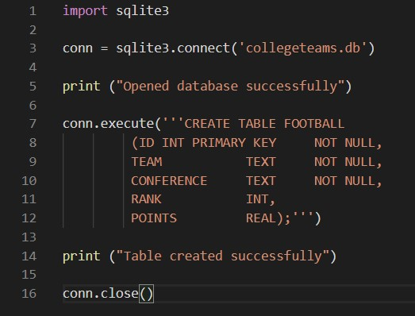
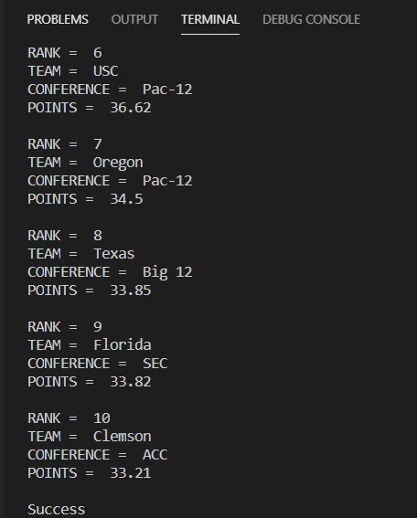
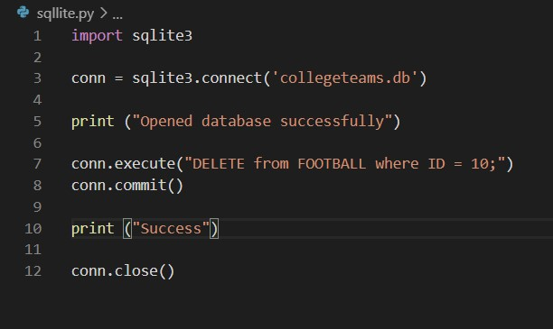
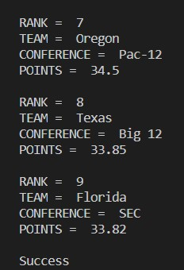
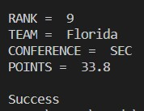

# SQL Databases

Author, Conner Pohlsander

## Overview

The purpose of this program is to create, modify, delete and query a database using Python with the SQLLite package. The data is self created from data and college football team rankings for every team to end in the top 25 since the year 2000. Each team was given points based off how well they ranked each season and given an overall ranking to determine which teams have been the most dominate in college football since 2000. This code was pushed to GitHub and the enviroment used was Visual Studio Code.

## Development Environment

* Python 8.3.2
* Visual Studio Code
* Python extension for VS Code
* SQLLite package for Python

If you are following along with this, make sure you first download the latest version of Python and Visual Studio Code and add the Python extension. Also download the SQLLite package for Python. To import this package, simply type ```import sqllite``` at the top of your Python script.

## Execution

After installing the SQLLite package, the first step is to create a database or connect to an existing one. To do this, this block of code needs to run, substituting the name of your database for the one I listed. If a database isn't already created, this code automatically creates one.

```
import sqlite3

conn = sqlite3.connect('collegeteams.db')

print ("Opened database successfully")
```

The print statement is there to ensure the program ran correctly.

Next step is to create a table in the database. The image below shows how that is done.



The next step is to add data to the table. This can be done by inserting data into the table. The long chunk of code below is the code I used to do this. Make sure you still have the line of code connecting to the database from the previous step.

```
conn.execute("INSERT INTO FOOTBALL (ID,TEAM,CONFERENCE,RANK,POINTS) \
      VALUES (1, 'Ohio State', 'Big Ten', 1, 51.6)")

conn.execute("INSERT INTO FOOTBALL (ID,TEAM,CONFERENCE,RANK,POINTS) \
      VALUES (2, 'Oklahoma', 'Big 12', 2, 50.61)")

conn.execute("INSERT INTO FOOTBALL (ID,TEAM,CONFERENCE,RANK,POINTS) \
      VALUES (3, 'Alabama', 'SEC', 3, 45.61)")

conn.execute("INSERT INTO FOOTBALL (ID,TEAM,CONFERENCE,RANK,POINTS) \
      VALUES (4, 'LSU', 'SEC', 4, 44.3)")

conn.execute("INSERT INTO FOOTBALL (ID,TEAM,CONFERENCE,RANK,POINTS) \
      VALUES (5, 'Georgia', 'SEC', 5, 37.23)")

conn.execute("INSERT INTO FOOTBALL (ID,TEAM,CONFERENCE,RANK,POINTS) \
      VALUES (6, 'USC', 'Pac-12', 6, 36.62)")

conn.execute("INSERT INTO FOOTBALL (ID,TEAM,CONFERENCE,RANK,POINTS) \
      VALUES (7, 'Oregon', 'Pac-12', 7, 34.5)")

conn.execute("INSERT INTO FOOTBALL (ID,TEAM,CONFERENCE,RANK,POINTS) \
      VALUES (8, 'Texas', 'Big 12', 8, 33.85)")

conn.execute("INSERT INTO FOOTBALL (ID,TEAM,CONFERENCE,RANK,POINTS) \
      VALUES (9, 'Florida', 'SEC', 9, 33.82)")

conn.execute("INSERT INTO FOOTBALL (ID,TEAM,CONFERENCE,RANK,POINTS) \
      VALUES (10, 'Clemson', 'ACC', 10, 33.21)")

conn.commit()

print ("Success")

conn.close()
```

The next step is to make sure that your data is in the database by using a select query. To do this, delete the code from the last step, and make a select query similar to this:
```
cursor = conn.execute("SELECT ID, team, conference, points from FOOTBALL")
for row in cursor:
   print ("RANK = ", row[0])
   print ("TEAM = ", row[1]) 
   print ("CONFERENCE = ", row[2])
   print ("POINTS = ", row[3], "\n")
   ```
Your program should output something like this:



What if you want to delete a row from the table? This is how you do that:



Running this code deleted Clemson form my database. Sometimes after watching Clemson play, I wish I could delete them in real life. (This is a joke)



The last thing I will cover is how to modify an item already existing in the data base. To do this, we will use the update operation. Let's say we wanted to change the amount of points Florida has from 33.82 to 33.8. This code will do that: 

```
conn.execute("UPDATE FOOTBALL set POINTS = 33.8 where ID = 9")
conn.commit()
print ("Total number of rows updated :", conn.total_changes)
```

And the results:



And that is a basic showcase of how to use and implement SQLLite. Hope you enjoyed!

## Helpful Links

* [https://www.tutorialspoint.com/sqlite/sqlite_python.htm](https://www.tutorialspoint.com/sqlite/sqlite_python.htm)
* [https://www.tutorialspoint.com/sqlite/sqlite_installation.htm](https://www.tutorialspoint.com/sqlite/sqlite_installation.htm)
